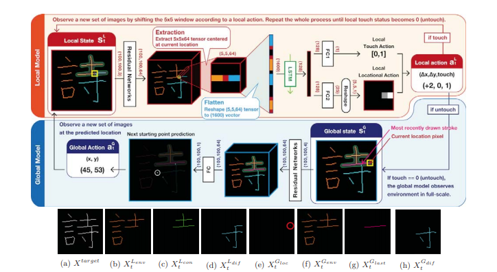

# Teaching_Robot_To_Draw
I3E論文複現，論文地址 : https://ieeexplore.ieee.org/abstract/document/8793484

learning different kinds of word's order via training a global model and a local model.

Global model is used to find the next start point when a stroke is finished , and local model is used to finish a stroke.

i.e.

